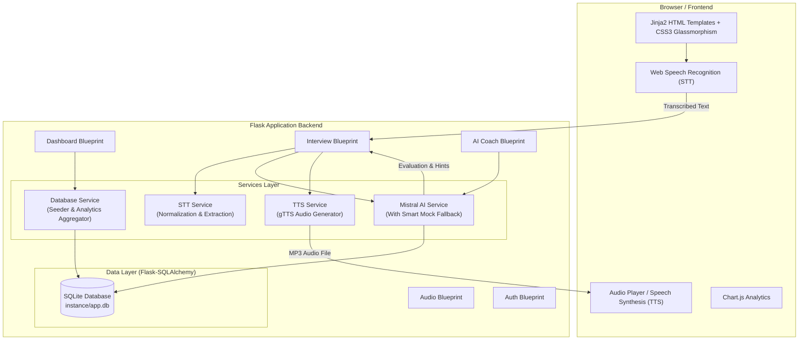

# 🚀 AI Career Connect

[](https://www.python.org/)
[](https://flask.palletsprojects.com/)
[](https://www.sqlalchemy.org/)
[](https://mistral.ai/)
[](LICENSE)

**AI Career Connect** is an intelligent, full-stack career development and interview preparation platform built with Python (Flask), SQLite (Flask-SQLAlchemy), Mistral AI LLM integration, native browser Speech-to-Text (STT), Google Text-to-Speech (gTTS), and an interactive analytics dashboard.

---

## 📋 Table of Contents

- [✨ Key Features](#-key-features)
- [🏗️ Architecture & System Design](#️-architecture--system-design)
- [📂 Folder & Project Structure](#-folder--project-structure)
- [🗄️ Database Models & Schema](#️-database-models--schema)
- [📡 API Endpoint Reference](#-api-endpoint-reference)
- [🤖 Smart Fallback & Simulation Engine](#-smart-fallback--simulation-engine)
- [🚦 Getting Started](#-getting-started)
- [🧪 Running Automated Tests](#-running-automated-tests)
- [🎨 Design & User Interface](#-design--user-interface)

---

## ✨ Key Features

### 🎙️ 1. AI Voice Mock Interview Studio
- **Real-Time Voice Studio**: Practice technical and behavioral interviews using spoken voice input.
- **Speech-to-Text (STT)**: Integrated with the Web Speech API (`webkitSpeechRecognition`) for hands-free audio recording with server-side text normalization and keyword extraction.
- **Text-to-Speech (TTS)**: Dynamic spoken audio feedback generated on the fly via `gTTS` (Google Text-to-Speech) and client-side browser synthesis.
- **AI-Powered Evaluation**: Mistral AI evaluates candidate speech, returning granular scoring (0–100), key takeaways, and constructive feedback.

### 📄 2. AI Resume & Skill Gap Auditor
- **Instant Audit**: Analyzes raw resume text against target job descriptions (e.g., Senior AI Engineer, Fullstack Developer).
- **Comprehensive Analysis**: Outputs match percentage score, detected strengths, missing technical skills, and actionable recommendations.
- **Historical Tracking**: Automatically records past audit results in the SQLite database.

### 🗺️ 3. Interactive Career Roadmap Generator
- **Personalized Pathways**: Generates step-by-step career progression timelines based on current experience level and target role.
- **Phase Breakdown**: Outlines key skill acquisition objectives, estimated timeframes, and descriptions for each progression milestone.

### 📊 4. Dynamic Analytics Dashboard
- **Readiness Index**: Calculates an aggregated Readiness Index dynamically from interview averages and resume audit scores.
- **Chart.js Integration**: Interactive progression charts tracking interview scores over time.
- **Recent Activity Feed**: Access past interview sessions, transcript summaries, and active career goals.

### ⚙️ 5. User Settings & Profile Management
- Configurable **Mistral API Key** settings with live status indicators.
- User profile updates for target role, experience level, technical skills, and bio.

---

## 🏗️ Architecture & System Design

AI Career Connect uses an enterprise-grade modular Flask application design pattern with strict separation of concerns across Models, Controllers (Blueprints), Services, and Views.



---

## 📂 Folder & Project Structure

```
AI Career Connect/
│
├── app/                        # MAIN APPLICATION PACKAGE
│   ├── __init__.py             # Application factory function (create_app) & database initialization
│   ├── config.py               # Application configuration settings (Secret key, DB URI, Mistral settings)
│   │
│   ├── models/                 # DATABASE MODELS LAYER (SQLAlchemy ORM)
│   │   ├── __init__.py         # Exports DB instance and entities
│   │   ├── user.py             # Candidate profile & target role entity
│   │   ├── interview.py        # InterviewSession & InterviewTranscript entities
│   │   ├── resume.py           # ResumeAnalysis record entity
│   │   └── career_goal.py      # CareerGoal milestone entity
│   │
│   ├── routes/                 # BLUEPRINTS & CONTROLLERS LAYER
│   │   ├── __init__.py         # Package initializer
│   │   ├── dashboard.py        # Dashboard view & stats API (/dashboard, /api/dashboard/stats)
│   │   ├── interview.py        # Voice studio routes (/interview, /api/interview/start, /submit_answer)
│   │   ├── ai_coach.py         # Resume audit & roadmap endpoints (/resume-analyzer, /career-roadmap)
│   │   ├── audio.py            # Audio processing (/api/tts/speak, /api/stt/transcribe)
│   │   └── auth.py             # Profile preferences & API settings (/settings, /api/settings/save)
│   │
│   ├── services/               # BUSINESS LOGIC & EXTERNAL SERVICES
│   │   ├── __init__.py         # Package initializer
│   │   ├── mistral_service.py  # Mistral AI LLM integration & offline simulation fallback
│   │   ├── stt_service.py      # Speech-to-Text transcript normalization & keyword extraction
│   │   ├── tts_service.py      # Text-to-Speech MP3 audio generator via gTTS
│   │   └── database_service.py # Database initial seeder & dashboard metric aggregator
│   │
│   ├── static/                 # CLIENT-SIDE STATIC ASSETS
│   │   ├── css/
│   │   │   └── style.css       # Custom design system with glassmorphism & dark mode styling
│   │   ├── js/
│   │   │   ├── voice.js        # Web Speech API wrapper for recording and voice synthesis
│   │   │   ├── dashboard.js    # Chart.js initialization and AJAX metric refresh
│   │   │   └── interview.js    # Real-time voice studio state controller
│   │   └── uploads/
│   │       └── audio/          # Storage directory for server-generated TTS MP3 files
│   │
│   └── templates/              # JINJA2 HTML TEMPLATES
│       ├── base.html           # Master layout template (sidebar, topbar, toast alerts)
│       ├── dashboard.html      # Main dashboard with readiness index & charts
│       ├── interview.html      # AI Voice Mock Interview room view
│       ├── resume_analyzer.html# AI Resume & Skill gap auditor view
│       ├── career_roadmap.html # Career roadmap & timeline generator view
│       └── settings.html       # API keys configuration & profile settings view
│
├── instance/                   # RUNTIME STORAGE
│   └── app.db                  # SQLite database file
│
├── tests/                      # AUTOMATED TEST SUITE
│   ├── test_routes.py          # Flask blueprints integration & API unit tests
│   └── test_services.py       # STT, TTS, and Mistral fallback service tests
│
├── .env.example                # Template environment variables file
├── .env                        # Local secret keys & API credentials (git-ignored)
├── requirements.txt            # Python dependencies
├── run.py                      # Server application entrypoint
└── README.md                   # Project documentation
```

---

## 🗄️ Database Models & Schema

The application uses **SQLite** managed via **Flask-SQLAlchemy**.

| Model | Table Name | Key Attributes | Relationships |
| :--- | :--- | :--- | :--- |
| **`User`** | `users` | `id`, `username`, `email`, `target_role`, `experience_level`, `skills`, `bio`, `created_at` | Has many `InterviewSession`, `ResumeAnalysis`, `CareerGoal` |
| **`InterviewSession`** | `interview_sessions` | `id`, `user_id`, `target_role`, `topic`, `status`, `score`, `summary_feedback`, `created_at` | Belongs to `User`; Has many `InterviewTranscript` |
| **`InterviewTranscript`** | `interview_transcripts` | `id`, `session_id`, `question`, `user_response_text`, `ai_feedback`, `score`, `ai_audio_url`, `created_at` | Belongs to `InterviewSession` |
| **`ResumeAnalysis`** | `resume_analyses` | `id`, `user_id`, `target_job_title`, `resume_text`, `match_score`, `strengths`, `missing_skills`, `recommendations`, `created_at` | Belongs to `User` |
| **`CareerGoal`** | `career_goals` | `id`, `user_id`, `goal_title`, `target_date`, `status`, `progress_percentage`, `milestones`, `created_at` | Belongs to `User` |

---

## 📡 API Endpoint Reference

### 📊 Dashboard & User APIs
- `GET /` or `GET /dashboard` — Renders main dashboard template.
- `GET /api/dashboard/stats` — Returns dynamic user stats, readiness score, and chart JSON data.
- `POST /api/user/profile` — Updates target role, experience level, and user skills.

### 🎙️ Voice Interview APIs
- `GET /interview` — Renders AI Voice Mock Interview room template.
- `POST /api/interview/start` — Initializes a new session and returns an AI-generated question + audio TTS payload.
- `POST /api/interview/submit_answer` — Submits candidate speech transcript, returns AI evaluation score, feedback, and TTS response audio.

### 📄 AI Coach & Resume APIs
- `GET /resume-analyzer` — Renders resume auditing interface.
- `POST /api/resume/analyze` — Audits resume text against a target role using Mistral AI and persists results.
- `GET /career-roadmap` — Renders career roadmap timeline view.
- `POST /api/roadmap/generate` — Generates a customized multi-phase career path roadmap.

### 🔊 Audio & Speech Processing APIs
- `POST /api/tts/speak` — Generates MP3 audio and TTS payload for provided text on the fly.
- `POST /api/stt/transcribe` — Normalizes raw STT speech text and extracts key domain phrases.

### ⚙️ Settings & Configuration APIs
- `GET /settings` — Renders user profile and API configuration settings page.
- `POST /api/settings/save` — Updates local Mistral API Key configuration and profile settings.

---

## 🤖 Smart Fallback & Simulation Engine

`AI Career Connect` is engineered to be **resilient**:
- If no `MISTRAL_API_KEY` is provided, or if the Mistral API is temporarily unreachable or offline, the platform automatically switches to its built-in **Smart Mock Engine**.
- The fallback engine generates context-aware interview questions, calculates candidate answer scores based on technical depth and response length, provides structured feedback, and produces resume audit breakdowns without crashing or raising unhandled exceptions.

---

## 🚦 Getting Started

### Prerequisites
- **Python 3.9+** installed on your system.

### 1. Clone & Set Up Project Directory
Navigate into the project directory:
```bash
cd "AI Career Connect"
```

### 2. Create Virtual Environment
```bash
# Windows
python -m venv env
env\Scripts\activate

# macOS / Linux
python3 -m venv env
source env/bin/activate
```

### 3. Install Dependencies
```bash
pip install -r requirements.txt
```

### 4. Configure Environment Variables
Copy `.env.example` to `.env`:
```bash
cp .env.example .env
```
Edit `.env` if you want to provide your `MISTRAL_API_KEY`:
```env
SECRET_KEY=dev-secret-key-ai-career-connect-2026
MISTRAL_API_KEY=your_mistral_api_key_here
DATABASE_URL=sqlite:///app.db
```
*(Note: If left blank, the built-in smart mock engine will be active.)*

### 5. Run the Server
Launch the application server:
```bash
python run.py
```
Open your browser and navigate to:
👉 **[http://127.0.0.1:5000](http://127.0.0.1:5000)**

---

## 🧪 Running Automated Tests

The application includes a pytest test suite verifying routes, database operations, STT/TTS services, and Mistral AI integration/fallback mechanisms.

To execute all tests:
```bash
pytest
```

To run with verbose output:
```bash
pytest -v
```

---

## 🎨 Design & User Interface

- **Color Palette**: Dark theme featuring deep midnight slates (`#0f172a`), royal violet accents (`#6366f1`), cyan highlights (`#06b6d4`), and emerald badges (`#10b981`).
- **Glassmorphism**: Translucent backdrop blurring, subtle glowing border highlights, and card elevations.
- **Responsive Layout**: Sidebar navigation, interactive stats cards, live microphone waveform indicators, and responsive grid layouts.

---

## 📄 License

Distributed under the MIT License. See `LICENSE` for more information.
